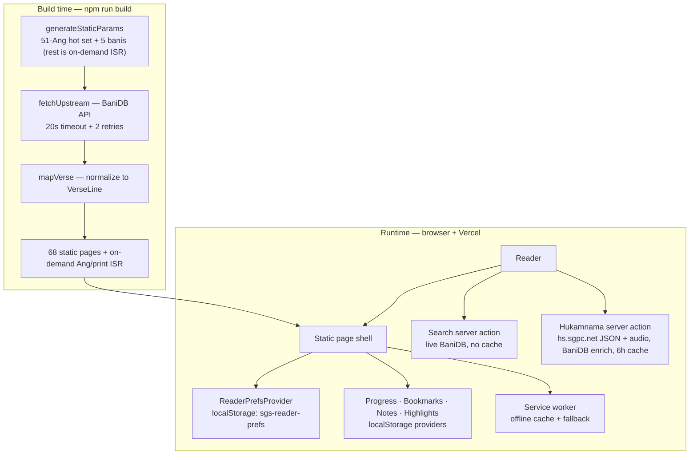
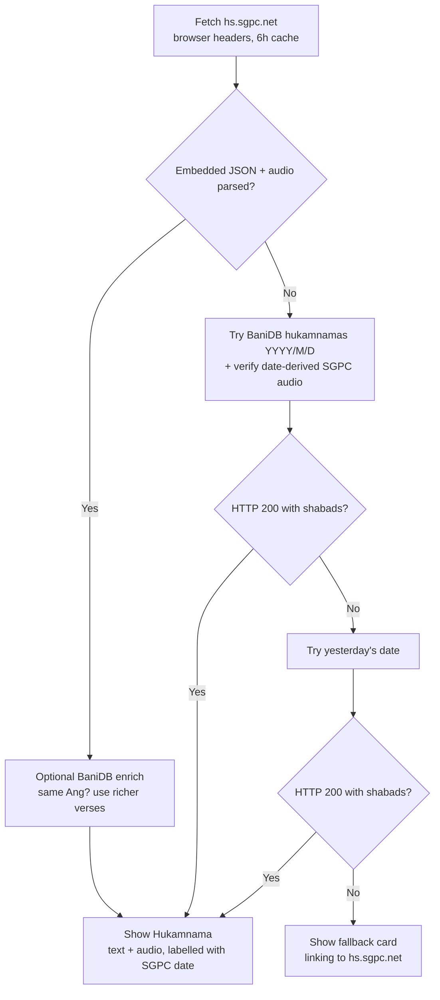
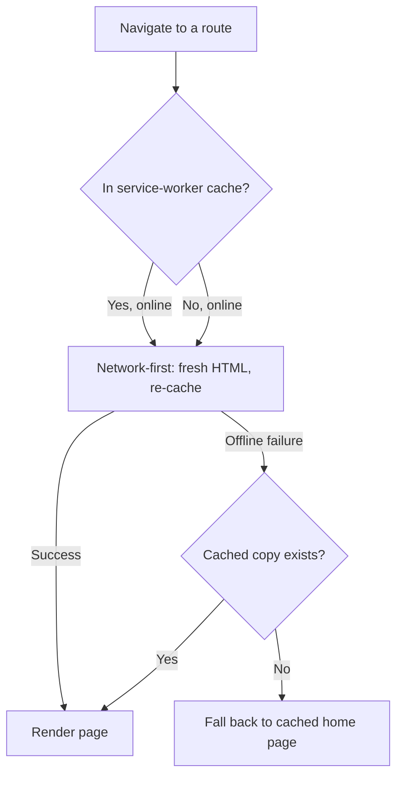
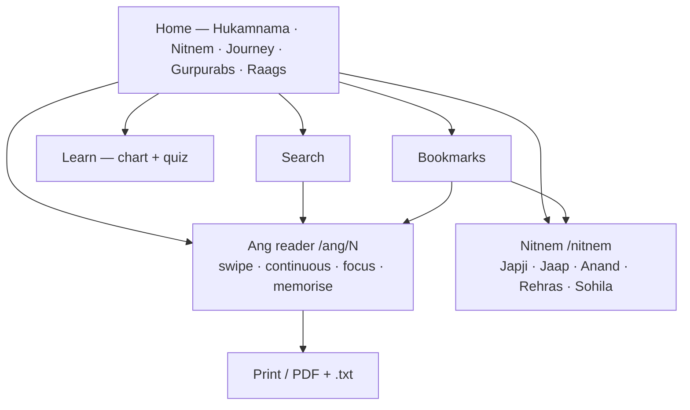

# Sri Guru Granth Sahib Ji Reader

[](https://nextjs.org/)
[](https://react.dev/)
[](https://www.typescriptlang.org/)
[](https://tailwindcss.com/)
[](https://playwright.dev/)
[](https://github.com/mithun-srinivasan/sggs/actions/workflows/ci.yml)
[](./LICENSE)

A focused, verse-by-verse web reader for Sri Guru Granth Sahib Ji — all 1,430 Angs
plus the five daily Nitnem Banis, genuine translations in four languages, real
teekas with correct attribution, word-by-word meanings, a daily Hukamnama from
SGPC, reading plans and streaks, and offline PWA support.

**Live:** https://srigurugranthsahib.vercel.app/

## Contents

- [How the whole product works](#how-the-whole-product-works)
- [Features](#features)
- [Technology](#technology)
- [Getting started](#getting-started)
- [Project structure](#project-structure)
- [Routes](#routes)
- [Testing](#testing)
- [Data sources and attribution](#data-sources-and-attribution)
- [Current limitations](#current-limitations)
- [Contributing](#contributing)
- [License](#license)

## How the whole product works

### System architecture — build time vs runtime

Most of the site is pre-rendered to static HTML at build time from BaniDB;
only dynamic pieces (search, Hukamnama refresh, user data) touch the network
at runtime.



### Verse rendering pipeline — one `VerseCard`

Every verse flows through the same layers, each independently toggleable in
Reader Settings:


### Daily Hukamnama flow — sourced from hs.sgpc.net, forever

SGPC publishes each day's Hukamnama at Amrit Vela on `hs.sgpc.net` as
embedded JSON (`#hukamnamaPdfData`: date, Ang, Gurmukhi, Punjabi, English)
plus audio. The app parses that page as the single source of truth; BaniDB
only enriches the verses when it carries the same Ang, and a BaniDB-only
today/yesterday fallback covers the pre-dawn gap or an SGPC outage.
Audio never depends on markup alone: the `<audio>` tags are parsed
tolerantly, with date-derived filenames (`SGPCNET{DDMMYY}.mp3` /
`katha{DDMMYY}.mp3`) as fallback — HEAD-verified on the BaniDB path — so
the players survive SGPC markup changes and page outages.



### Offline flow — installed PWA without network



### Reader journey map



## Features

### Ang reader (`/ang/[id]`, all 1,430 Angs)

- Unicode Gurmukhi, four transliteration scripts (English / Hindi / Urdu / IPA).
- Translations in **English, Punjabi, Hindi, and Spanish** — genuine BaniDB
  sources, switchable in settings, plus parallel English + Punjabi mode.
- **Text & Commentary** — a real, attributable teeka block (not a relabelled
  translation): SGPC English rendering, Guru Granth Darpan, or Faridkot Teeka,
  switchable by language and source.
- **Word meanings** — per-verse pad-arth block where BaniDB provides it.
- Santhya pause (visraam) markers in the Gurmukhi line (`,` short, `;` long).
- Copy verse (with attribution), share as PNG card, 4-colour highlights,
  private notes, bookmarks with folders/tags.
- Lareevar mode, continuous reading (next Ang appended inline), focus mode
  (top bar edge-peeks on mouse approach so Settings stays reachable),
  memorisation mode, tap-to-transliterate.
- Swipe navigation, scroll sentinels, auto-hiding top/bottom bars.
- Print / Save-as-PDF view at `/ang/[id]/print` with all four translations,
  plus a `.txt` download.

### Nitnem (`/nitnem`)

- The five daily prayers in traditional order — Japji Sahib, Jaap Sahib,
  Anand Sahib, Rehras Sahib, Kirtan Sohila — each a statically generated
  reader with the same translations, commentary, and word meanings.
- Home-page card with recitation-time chips; bani-aware bookmarks that
  deep-link back to the Nitnem page.

### Reader preferences

Light / dark / sepia themes, auto theme, OLED black, custom accent, text size
80%–160%, all reading modes and toggles. Persisted in `localStorage` under
`sgs-reader-prefs` with validation so corrupt data can never break the app.

### Daily Hukamnama

SGPC's official scan image + page link, paired with BaniDB's text mirror of
the same Sri Darbar Sahib selection; pre-dawn fallback to the previous (still
current) Hukamnama; cached six hours.

### Reading journey

Progress bar (x/1430), streaks, reading history, N-day Sehaj Paath plans with
a daily Ang range, and a **daily goal tracker** (Angs/day with today's
progress bar). Stored in `localStorage` under `sgs-reader-progress`.

### Shabad of the Day, heatmap, calendar

- A random full shabad every day (stable all day via a date-keyed cache).
- A GitHub-style 20-week reading-activity heatmap built from visit history.
- A full Nanakshahi calendar (`/calendar`) with Sangrand markers and
  Gurpurab links to each event's verified Bani Ang.

### Learn Gurmukhi (`/learn`)

Full akhar chart (seven traditional groups + ten lagan-matra vowel signs,
every item with English transliteration) above a multiple-choice quiz with
score and streak tracking.

### Home page extras

- Upcoming Gurpurabs (Nanakshahi) — each card links to that event's **verified
  own Bani** and shows the destination Ang chip.
- Resume / random Ang, quick-jump slider, 31-Raag index, featured verses.

### Search, bookmarks, shortcuts, PWA

- `/search` (live BaniDB, Gurmukhi, Roman auto-converted to Gurmukhi, or
  English) with an **offline fallback** over Angs you have already read,
  plus recent-search shortcuts; `/bookmarks` (tags, print, JSON export/import).
- **Hukamnama reminders** — opt-in bell on the Hukamnama card for a once-a-day
  notification (delivered when the app is opened; no account or server).
- **Device sync** — `/sync` transfers the full backup directly between your
  devices over encrypted WebRTC (manual codes, same WiFi works best).
- Keyboard shortcuts (press `?`).
- Installable PWA: web manifest, production-only service worker with
  precached shell, runtime route caching, offline home fallback, and an
  offline indicator banner.

## Technology

- Next.js 16.3.5 (App Router, Turbopack) + React 19 + TypeScript (strict).
- Tailwind CSS v4, Lucide icons, Vercel Analytics + Speed Insights.
- BaniDB v2 API (scripture, translations, teekas, pad-arth, banis).
- SGPC website scrape (daily Hukamnama image only).
- ESLint (`eslint-config-next`, zero-error policy) + Playwright (Chromium).

## Getting started

Requirements: Node.js 20+, npm, and internet access (BaniDB at build time;
Hukamnama/search at runtime).

```bash
npm install
npm run dev        # http://localhost:3000
```

Production build (pre-renders a 68-page hot set; all other Angs and print pages render on-demand via ISR — under half a minute):

```bash
npm run build
npm run start
```

### Available scripts

| Command | Purpose |
| --- | --- |
| `npm run dev` | Local development server |
| `npm run build` | Production build + full static generation |
| `npm run start` | Serve the production build locally |
| `npm run typecheck` | TypeScript `tsc --noEmit` |
| `npm run lint` | ESLint over the repo (must report 0 errors) |
| `npm run validate:sgpc` | Validate every `public/data/sgpc-<year>.json` (months, dates, Ang range) |
| `npm run test` | Playwright suite, headless Chromium |
| `npm run test:ui` | Playwright interactive UI mode |

## Project structure

```text
sggs-reader/
├── app/                            # Routes (Next.js App Router)
│   ├── layout.tsx                  # Root layout, fonts, metadata, providers
│   ├── page.tsx                    # Home page
│   ├── globals.css                 # Theme tokens, focus/print CSS
│   ├── manifest.ts                 # PWA web-app manifest
│   ├── actions.ts                  # Server action: getTodaysHukamnama
│   ├── icon.svg / favicon.ico / apple-icon.png
│   │                               # App icons
│   ├── ang/[id]/
│   │   ├── page.tsx                # Ang reader + hot-set generation (rest on-demand ISR)
│   │   ├── actions.ts              # Server action: getAngForReader (continuous mode)
│   │   ├── ClientAngReader.tsx     # Chains Angs for continuous mode
│   │   ├── AngStartSentinel.tsx    # Scroll-edge navigation (top)
│   │   ├── AngEndSentinel.tsx      # Scroll-edge navigation (bottom)
│   │   ├── AngUnavailable.tsx      # Error card when an Ang fails to load
│   │   ├── BottomNav.tsx           # Scroll-aware bottom navigation
│   │   ├── not-found.tsx           # Custom 404 for out-of-range Angs
│   │   └── print/
│   │       ├── page.tsx            # Print / PDF layout (on-demand ISR)
│   │       └── PrintAng.tsx        # Print controls + formatting
│   ├── nitnem/
│   │   ├── page.tsx                # Nitnem index (five daily prayers)
│   │   └── [token]/page.tsx        # Bani reader (statically generated ×5)
│   ├── bookmarks/page.tsx          # Saved verses: tags, print, import/export, backup
│   ├── calendar/page.tsx           # Nanakshahi month grid + Gurpurab links
│   ├── learn/page.tsx              # Gurmukhi chart + practice quiz
│   └── search/
│       ├── page.tsx                # Search UI (Gurmukhi / Roman / English + offline fallback)
│       └── actions.ts              # Search server action (live BaniDB)
│   ├── sync/page.tsx               # Device-to-device sync (manual WebRTC codes)
├── components/                     # UI building blocks
│   ├── NavigationBar.tsx           # Top bar (scroll-aware + hover edge-peek)
│   ├── ReaderControls.tsx          # Settings panel (display, modes, languages)
│   ├── ReaderPrefsProvider.tsx     # Preferences context (localStorage)
│   ├── BookmarksProvider.tsx       # Bookmarks + tags (localStorage)
│   ├── ProgressProvider.tsx        # Progress, streaks, history, plans, goals
│   ├── NotesProvider.tsx           # Verse notes (localStorage)
│   ├── HighlightsProvider.tsx      # 4-colour highlights (localStorage)
│   ├── VerseCard.tsx               # One verse: text layers + actions
│   ├── HukamnamaCard.tsx           # Daily Hukamnama (hs.sgpc.net + BaniDB enrich)
│   ├── HukamnamaNotifyButton.tsx   # Opt-in daily reminder toggle (Notification API)
│   ├── ShabadOfDayCard.tsx         # Random daily shabad (date-keyed cache)
│   ├── ReadingHeatmap.tsx          # 20-week activity grid from visit history
│   ├── ReadingJourney.tsx          # Progress / streak / plan / goal card
│   ├── GurpurabCalendar.tsx        # Upcoming Gurpurabs card + full-calendar link
│   ├── NitnemCard.tsx              # Home-page daily-prayers card
│   ├── OfflineIndicator.tsx        # Offline banner
│   ├── ServiceWorkerRegistrar.tsx  # Registers /sw.js in production
│   ├── SwipeContainer.tsx          # Touch-swipe navigation wrapper
│   ├── PageTransition.tsx          # Route-change transition
│   ├── ShortcutHelp.tsx            # `?` keyboard-shortcut modal
│   └── SikhSymbols.tsx             # Shared SVG symbols (Ik Onkar, Khanda)
├── lib/                            # Data + domain logic (no JSX)
│   ├── data.ts                     # BaniDB fetching, mapping, Hukamnama, banis
│   ├── types.ts                    # Shared types (VerseLine, Bani, prefs, …)
│   ├── sgpc.ts                     # Year-aware SGPC loader (bundled → JSON + cache)
│   ├── nanakshahi.ts               # Nanakshahi months, conversion, Sangrand
│   ├── gurpurabs.ts                # SGPC Samvat 558 Gurpurab → Ang table
│   ├── nitnem.ts                   # Nitnem metadata table (client-safe)
│   ├── backup.ts                   # Full local-data backup/restore (6 slices)
│   ├── sync.ts                     # Serverless WebRTC sync (manual signalling)
│   ├── offline-search.ts           # Visited-Ang index + offline search fallback
│   ├── notifications.ts            # Reminder prefs + check-on-visit delivery
│   ├── gurmukhi.ts                 # Akhar + lagan-matra data for Learn page
│   ├── shortcuts.ts                # Canonical shortcut list (see `?` modal)
│   ├── downloadAng.ts              # .txt download + share-card canvas
│   └── useSwipeNavigation.ts       # Swipe-nav hook
├── public/                         # Static assets + PWA
│   ├── sw.js                       # Service worker (offline cache, /data JSON, reminder taps)
│   ├── data/sgpc-558.json          # SGPC Samvat 558 months + Gurpurabs
│   ├── golden-temple-night.png     # Home hero image
│   └── icon-192.png / icon-512.png # PWA icons
├── scripts/
│   └── validate-sgpc.mjs           # Validator for public/data/sgpc-*.json
├── tests/                          # Playwright suite (Chromium)
│   ├── ang-navigation.spec.ts
│   ├── ang-range.spec.ts
│   ├── ang-advance.spec.ts
│   ├── commentary.spec.ts
│   ├── learn-gurpurab.spec.ts
│   ├── new-features.spec.ts
│   ├── more-features.spec.ts
│   └── sgpc-calendar.spec.ts
├── .github/workflows/ci.yml        # CI: typecheck → lint → validate:sgpc → Playwright
├── eslint.config.mjs               # ESLint (eslint-config-next, zero-error policy)
├── next.config.ts                  # Next.js config
├── tsconfig.json                   # TypeScript config (strict)
├── postcss.config.mjs              # PostCSS / Tailwind v4
├── playwright.config.ts            # Playwright config (Chromium, dev-server autostart)
└── AGENTS.md                       # Agent working rules (read before changing code)
```

Where to look:

| I want to … | Start here |
| --- | --- |
| Change how a verse renders | `components/VerseCard.tsx` + `lib/types.ts` |
| Change reader settings / themes | `components/ReaderControls.tsx` + `components/ReaderPrefsProvider.tsx` |
| Change bookmarks, notes, highlights, progress, reminders | `components/*Provider.tsx` + `lib/backup.ts` |
| Change the Hukamnama | `app/actions.ts` + `lib/data.ts` + `components/HukamnamaCard.tsx` |
| Change Hukamnama reminders | `components/HukamnamaNotifyButton.tsx` + `lib/notifications.ts` |
| Change offline search | `app/search/page.tsx` + `lib/offline-search.ts` |
| Change device sync | `app/sync/page.tsx` + `lib/sync.ts` |
| Change the calendar / Gurpurabs | `app/calendar/page.tsx` + `lib/sgpc.ts`, `lib/nanakshahi.ts`, `lib/gurpurabs.ts` |
| Add a keyboard shortcut | `lib/shortcuts.ts` + `components/ShortcutHelp.tsx` |
| Change offline behaviour | `public/sw.js` + `components/ServiceWorkerRegistrar.tsx` |
| Add a new year of SGPC dates | `public/data/sgpc-*.json` + `scripts/validate-sgpc.mjs` |

## Routes

| Route | Description |
| --- | --- |
| `/` | Home: Hukamnama, Nitnem, journey, Gurpurabs, Raags |
| `/ang/1` … `/ang/1430` | Verse-by-verse Ang reader pages |
| `/ang/[id]/print` | Print / Save-as-PDF layout |
| `/nitnem` | Daily Nitnem index |
| `/nitnem/japji` · `/jaap` · `/anand` · `/rehras` · `/sohila` | Bani readers |
| `/learn` | Gurmukhi chart + quiz |
| `/search` | Gurbani search (Gurmukhi / Roman / English, offline fallback) |
| `/bookmarks` | Saved verses (localStorage) |
| `/sync` | Device-to-device data transfer (serverless WebRTC) |
| `/calendar` | Nanakshahi calendar with Gurpurabs |

Invalid Ang numbers or bani tokens show a custom not-found page.

## Testing

```bash
npm run test        # headless Playwright run (Chromium)
npm run test:ui     # interactive UI mode
```

32 tests cover Ang navigation, theme persistence, genuine commentary sources
and switching, the Learn chart, Gurpurab Ang chips, Hindi/Spanish switching,
pad-arth display, Nitnem pages, the daily goal tracker, visraam markers,
Shabad of the Day, the heatmap, phonetic-search preview, verse share-card
download, the calendar (month grid, ←/→ keyboard nav), the SGPC year JSON,
top-bar hover reveal, and Hukamnama resolution with translation layers. CI (`.github/workflows/ci.yml`) runs typecheck,
lint, `validate:sgpc`, and the full suite on every push/PR.

## SGPC calendar releases (no-code-change years)

The calendar is year-aware. `lib/sgpc.ts` serves the bundled Samvat 558
tables instantly, then adopts `/data/sgpc-<year>.json` (cached in
localStorage) when present. To publish a new Nanakshahi year:

1. Copy `public/data/sgpc-558.json` to `public/data/sgpc-559.json`.
2. Update its month starts, day counts, and Gurpurab month/day entries from
   the new SGPC jantri (lunar events move every year — never copy them blindly).
3. Run `npm run validate:sgpc`, then redeploy. The home card, calendar page,
   and offline cache pick the file up automatically.

Set `NEXT_PUBLIC_SGPC_CALENDAR_BASE_URL` to host the JSON remotely instead
of bundling it.

## Data sources and attribution

Scripture text, translations, teekas, and pad-arth come from the
[BaniDB API](https://github.com/KhalisFoundation/BaniDB-API) (Khalis
Foundation), whose published translation sources are:

| BaniDB key | Source | Used as |
| --- | --- | --- |
| `en.bdb` / `en.ssk` | Dr. Sant Singh Khalsa (SikhNet) | Default English translation |
| `en.ms` | Bhai Manmohan Singh (SGPC) | English commentary rendering |
| `pu.ss` / `pu.bdb` | Prof. Sahib Singh, *Guru Granth Darpan* (SGPC) | Punjabi translation + Darpan commentary |
| `pu.ft` | *Faridkot Teeka*, Sant Giani Badan Singh Ji | Faridkot commentary |
| `pu.pss` | Pad-arth (word meanings) | Word-meanings block |
| `hi.ss` / `hi.sts` | Hindi renderings | Hindi translation |
| `es.sn` | Spanish rendering | Spanish translation |

The Daily Hukamnama text and audio come from the SGPC live page
[hs.sgpc.net](https://hs.sgpc.net/) (parsed server-side with browser-like
headers, 6-hour cache); its text is BaniDB's
mirror of the same Sri Darbar Sahib selection. Review both providers' current
terms before deploying publicly.

## Current limitations

- Bookmarks, preferences, progress, notes, highlights, and reminder choices
  are browser-local with no account or cloud — use “Back up all” on the
  bookmarks page to export all six slices to one JSON file, restore it after
  clearing browser data, or move it directly between devices at `/sync`.
- Search depends on the BaniDB service and network availability; offline it
  falls back to Angs you have already read.
- Reminders fire when the app is opened (no push server by design) — install
  the PWA and allow notifications for the best results.
- Hot-set Ang/bani data is fetched at build time and refreshed weekly —
  a rebuild picks up any upstream corrections immediately.
- Lunar-origin Gurpurabs move every Gregorian year, so each new Nanakshahi
  year needs its own `public/data/sgpc-<year>.json` (see above).

## Contributing

Contributions are welcome. Please read [CONTRIBUTING.md](./CONTRIBUTING.md)
for setup, scripts, branching, and the pull-request checklist, and follow the
[Code of Conduct](./CODE_OF_CONDUCT.md). Report security issues privately per
[SECURITY.md](./SECURITY.md) — do not open a public issue.

## License

MIT — see [LICENSE](./LICENSE). The license covers this application's code;
scripture, translations, and third-party data remain under their providers'
terms (see attribution above).
