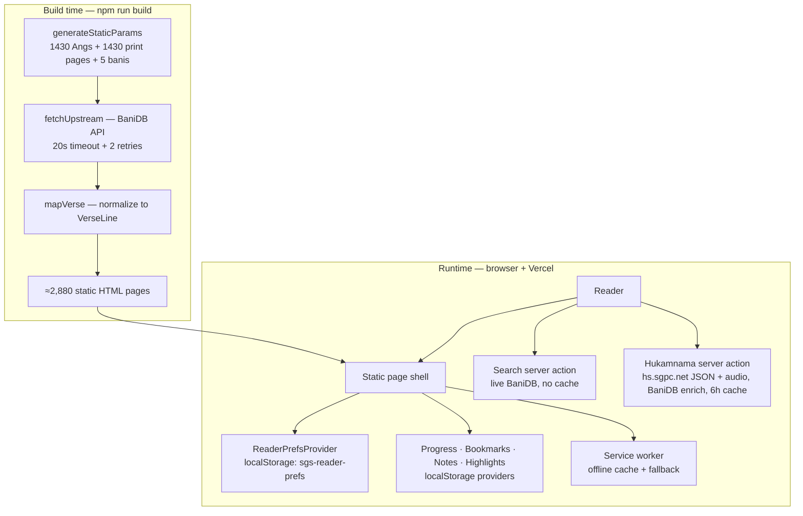
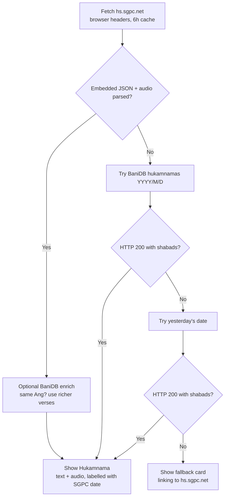
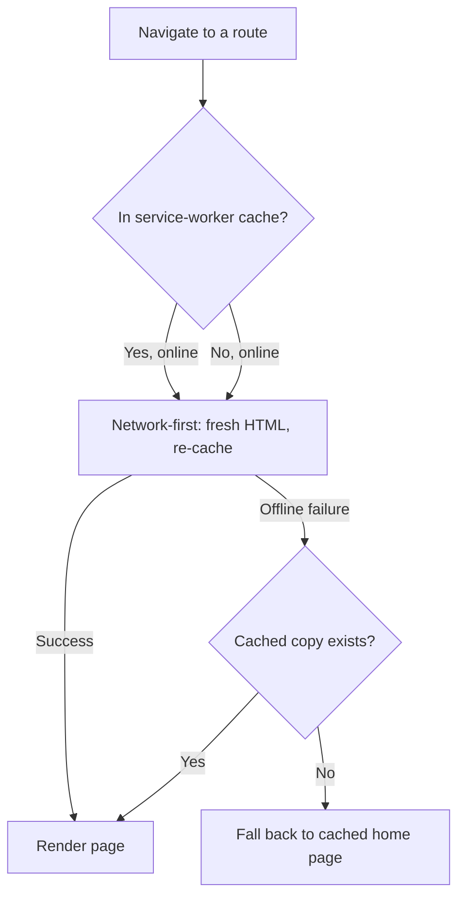
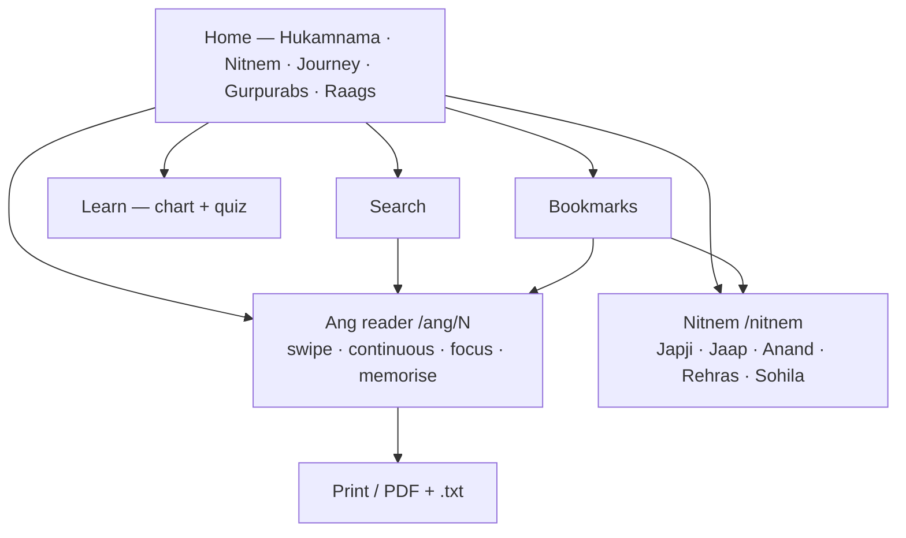

# Sri Guru Granth Sahib Ji Reader

[](https://nextjs.org/)
[](https://react.dev/)
[](https://www.typescriptlang.org/)
[](https://tailwindcss.com/)
[](https://playwright.dev/)
[](./LICENSE)

A focused, verse-by-verse web reader for Sri Guru Granth Sahib Ji — all 1,430 Angs
plus the five daily Nitnem Banis, genuine translations in four languages, real
teekas with correct attribution, word-by-word meanings, a daily Hukamnama from
SGPC, reading plans and streaks, and offline PWA support.

**Live:** `https://srigurugranthsahib.vercel.app/`

## Contents

- [How the whole product works](#how-the-whole-product-works)
- [Features](#features)
- [Technology](#technology)
- [Getting started](#getting-started)
- [Project structure](#project-structure)
- [Routes](#routes)
- [Testing](#testing)
- [Data sources and attribution](#data-sources-and-attribution)
- [Current limitations](#current-limitations)
- [License](#license)

## How the whole product works

### System architecture — build time vs runtime

Most of the site is pre-rendered to static HTML at build time from BaniDB;
only dynamic pieces (search, Hukamnama refresh, user data) touch the network
at runtime.



### Verse rendering pipeline — one `VerseCard`

Every verse flows through the same layers, each independently toggleable in
Reader Settings:


### Daily Hukamnama flow — sourced from hs.sgpc.net, forever

SGPC publishes each day's Hukamnama at Amrit Vela on `hs.sgpc.net` as
embedded JSON (`#hukamnamaPdfData`: date, Ang, Gurmukhi, Punjabi, English)
plus audio. The app parses that page as the single source of truth; BaniDB
only enriches the verses when it carries the same Ang, and a BaniDB-only
today/yesterday fallback covers the pre-dawn gap or an SGPC outage.



### Offline flow — installed PWA without network



### Reader journey map



## Features

### Ang reader (`/ang/[id]`, all 1,430 Angs)

- Unicode Gurmukhi, four transliteration scripts (English / Hindi / Urdu / IPA).
- Translations in **English, Punjabi, Hindi, and Spanish** — genuine BaniDB
  sources, switchable in settings, plus parallel English + Punjabi mode.
- **Text & Commentary** — a real, attributable teeka block (not a relabelled
  translation): SGPC English rendering, Guru Granth Darpan, or Faridkot Teeka,
  switchable by language and source.
- **Word meanings** — per-verse pad-arth block where BaniDB provides it.
- Santhya pause (visraam) markers in the Gurmukhi line (`,` short, `;` long).
- Copy verse (with attribution), share as PNG card, 4-colour highlights,
  private notes, bookmarks with folders/tags.
- Lareevar mode, continuous reading (next Ang appended inline), focus mode
  (top bar edge-peeks on mouse approach so Settings stays reachable),
  memorisation mode, tap-to-transliterate.
- Swipe navigation, scroll sentinels, auto-hiding top/bottom bars.
- Print / Save-as-PDF view at `/ang/[id]/print` with all four translations,
  plus a `.txt` download.

### Nitnem (`/nitnem`)

- The five daily prayers in traditional order — Japji Sahib, Jaap Sahib,
  Anand Sahib, Rehras Sahib, Kirtan Sohila — each a statically generated
  reader with the same translations, commentary, and word meanings.
- Home-page card with recitation-time chips; bani-aware bookmarks that
  deep-link back to the Nitnem page.

### Reader preferences

Light / dark / sepia themes, auto theme, OLED black, custom accent, text size
80%–160%, all reading modes and toggles. Persisted in `localStorage` under
`sgs-reader-prefs` with validation so corrupt data can never break the app.

### Daily Hukamnama

SGPC's official scan image + page link, paired with BaniDB's text mirror of
the same Sri Darbar Sahib selection; pre-dawn fallback to the previous (still
current) Hukamnama; cached six hours.

### Reading journey

Progress bar (x/1430), streaks, reading history, N-day Sehaj Paath plans with
a daily Ang range, and a **daily goal tracker** (Angs/day with today's
progress bar). Stored in `localStorage` under `sgs-reader-progress`.

### Shabad of the Day, heatmap, calendar

- A random full shabad every day (stable all day via a date-keyed cache).
- A GitHub-style 20-week reading-activity heatmap built from visit history.
- A full Nanakshahi calendar (`/calendar`) with Sangrand markers and
  Gurpurab links to each event's verified Bani Ang.

### Learn Gurmukhi (`/learn`)

Full akhar chart (seven traditional groups + ten lagan-matra vowel signs,
every item with English transliteration) above a multiple-choice quiz with
score and streak tracking.

### Home page extras

- Upcoming Gurpurabs (Nanakshahi) — each card links to that event's **verified
  own Bani** and shows the destination Ang chip.
- Resume / random Ang, quick-jump slider, 31-Raag index, featured verses.

### Search, bookmarks, shortcuts, PWA

- `/search` (live BaniDB, Gurmukhi, Roman auto-converted to Gurmukhi, or
  English), `/bookmarks` (tags, print, JSON export/import).
- Keyboard shortcuts (press `?`).
- Installable PWA: web manifest, production-only service worker with
  precached shell, runtime route caching, offline home fallback, and an
  offline indicator banner.

## Technology

- Next.js 16.3.5 (App Router, Turbopack) + React 19 + TypeScript (strict).
- Tailwind CSS v4, Lucide icons, Vercel Analytics + Speed Insights.
- BaniDB v2 API (scripture, translations, teekas, pad-arth, banis).
- SGPC website scrape (daily Hukamnama image only).
- ESLint (`eslint-config-next`, zero-error policy) + Playwright (Chromium).

## Getting started

Requirements: Node.js 20+, npm, and internet access (BaniDB at build time;
Hukamnama/search at runtime).

```bash
npm install
npm run dev        # http://localhost:3000
```

Production build (pre-renders ≈2,880 static pages — takes a few minutes):

```bash
npm run build
npm run start
```

### Available scripts

| Command | Purpose |
| --- | --- |
| `npm run dev` | Local development server |
| `npm run build` | Production build + full static generation |
| `npm run start` | Serve the production build locally |
| `npm run typecheck` | TypeScript `tsc --noEmit` |
| `npm run lint` | ESLint over the repo (must report 0 errors) |
| `npm run validate:sgpc` | Validate every `public/data/sgpc-<year>.json` (months, dates, Ang range) |
| `npm run test` | Playwright suite, headless Chromium |
| `npm run test:ui` | Playwright interactive UI mode |

## Project structure

```text
app/
  layout.tsx                     Root layout, fonts, metadata, providers
  page.tsx                       Home page
  manifest.ts                    PWA web-app manifest
  actions.ts                     Server action: getTodaysHukamnama
  globals.css                    Theme tokens, focus/print CSS
  ang/[id]/
    page.tsx                     Ang reader + static route generation
    actions.ts                   Server action: getAngForReader (continuous mode)
    ClientAngReader.tsx          Chains Angs for continuous mode
    AngStartSentinel.tsx / AngEndSentinel.tsx   Scroll-edge navigation
    BottomNav.tsx                Scroll-aware bottom navigation
    not-found.tsx                Custom 404 for out-of-range Angs
    print/page.tsx               Print / PDF layout · PrintAng.tsx controls
  nitnem/page.tsx                Nitnem index (five daily prayers)
  nitnem/[token]/page.tsx        Bani reader (statically generated ×5)
  bookmarks/page.tsx             Saved verses: tags, print, import/export, full backup
  learn/page.tsx                 Gurmukhi chart + practice quiz
  search/page.tsx + actions.ts   Gurbani search (Gurmukhi/Roman/English) + action
  calendar/page.tsx              Nanakshahi month grid + Gurpurab links (←/→ keys, auto-update)
components/
  NavigationBar.tsx              Top bar (scroll-aware + hover edge-peek on every Ang)
  ReaderControls.tsx             Settings panel (display, modes, languages)
  ReaderPrefsProvider.tsx        Preferences context (localStorage)
  BookmarksProvider.tsx          Bookmarks + tags (localStorage)
  ProgressProvider.tsx           Progress, streaks, history, plans, goals
  NotesProvider.tsx / HighlightsProvider.tsx   Notes + colours (localStorage)
  VerseCard.tsx                  One verse: layers + actions
  HukamnamaCard.tsx              Daily Hukamnama (hs.sgpc.net text + audio, BaniDB enrich)
  ShabadOfDayCard.tsx            Random daily shabad (date-keyed cache)
  ReadingHeatmap.tsx             20-week activity grid from visit history
  NitnemCard.tsx                 Home-page daily-prayers card
  ReadingJourney.tsx             Progress/streak/plan/goal card
  GurpurabCalendar.tsx           Upcoming Gurpurabs card (year-aware + Full-calendar button)
  OfflineIndicator.tsx           Offline banner · ServiceWorkerRegistrar.tsx
  SwipeContainer.tsx · PageTransition.tsx · ShortcutHelp.tsx · SikhSymbols.tsx
lib/
  data.ts                        BaniDB fetching (timeout+retry), mapping,
                                  search, Hukamnama (hs.sgpc.net forever), banis
  types.ts                       Shared types (VerseLine, Bani, prefs, …)
  nitnem.ts                      Nitnem metadata table (client-safe)
  nanakshahi.ts                  Nanakshahi months, conversion, Sangrand (SGPC 558)
  gurpurabs.ts                   SGPC Samvat 558 Gurpurab → Ang table
  sgpc.ts                        Year-aware SGPC loader (bundled → JSON + cache)
  backup.ts                      Full local-data backup/restore (5 slices, one file)
  gurmukhi.ts                    Akhar + lagan-matra data for Learn page
  shortcuts.ts · downloadAng.ts · useSwipeNavigation.ts
public/
  sw.js                          Service worker (v3 offline caching, incl. /data JSON)
  data/sgpc-558.json             SGPC Samvat 558 months + Gurpurabs (add sgpc-559.json for next year)
  icon-192.png · icon-512.png · golden-temple-night.png
scripts/
  validate-sgpc.mjs              CI/local validator for public/data/sgpc-*.json
tests/
  ang-navigation.spec.ts · commentary.spec.ts · learn-gurpurab.spec.ts
  new-features.spec.ts · more-features.spec.ts · sgpc-calendar.spec.ts   Playwright suite (24 tests)
.github/workflows/ci.yml        CI: typecheck + lint + validate:sgpc + Playwright
eslint.config.mjs · next.config.ts · next-env.d.ts
```

## Routes

| Route | Description |
| --- | --- |
| `/` | Home: Hukamnama, Nitnem, journey, Gurpurabs, Raags |
| `/ang/1` … `/ang/1430` | Verse-by-verse Ang reader pages |
| `/ang/[id]/print` | Print / Save-as-PDF layout |
| `/nitnem` | Daily Nitnem index |
| `/nitnem/japji` · `/jaap` · `/anand` · `/rehras` · `/sohila` | Bani readers |
| `/learn` | Gurmukhi chart + quiz |
| `/search` | Gurbani search (Gurmukhi / Roman / English) |
| `/bookmarks` | Saved verses (localStorage) |
| `/calendar` | Nanakshahi calendar with Gurpurabs |

Invalid Ang numbers or bani tokens show a custom not-found page.

## Testing

```bash
npm run test        # headless Playwright run (Chromium)
npm run test:ui     # interactive UI mode
```

24 tests cover Ang navigation, theme persistence, genuine commentary sources
and switching, the Learn chart, Gurpurab Ang chips, Hindi/Spanish switching,
pad-arth display, Nitnem pages, the daily goal tracker, visraam markers,
Shabad of the Day, the heatmap, phonetic-search preview, the calendar
(month grid, ←/→ keyboard nav), the SGPC year JSON, top-bar hover reveal,
and Hukamnama resolution. CI (`.github/workflows/ci.yml`) runs typecheck,
lint, `validate:sgpc`, and the full suite on every push/PR.

## SGPC calendar releases (no-code-change years)

The calendar is year-aware. `lib/sgpc.ts` serves the bundled Samvat 558
tables instantly, then adopts `/data/sgpc-<year>.json` (cached in
localStorage) when present. To publish a new Nanakshahi year:

1. Copy `public/data/sgpc-558.json` to `public/data/sgpc-559.json`.
2. Update its month starts, day counts, and Gurpurab month/day entries from
   the new SGPC jantri (lunar events move every year — never copy them blindly).
3. Run `npm run validate:sgpc`, then redeploy. The home card, calendar page,
   and offline cache pick the file up automatically.

Set `NEXT_PUBLIC_SGPC_CALENDAR_BASE_URL` to host the JSON remotely instead
of bundling it.

## Data sources and attribution

Scripture text, translations, teekas, and pad-arth come from the
[BaniDB API](https://github.com/KhalisFoundation/BaniDB-API) (Khalis
Foundation), whose published translation sources are:

| BaniDB key | Source | Used as |
| --- | --- | --- |
| `en.bdb` / `en.ssk` | Dr. Sant Singh Khalsa (SikhNet) | Default English translation |
| `en.ms` | Bhai Manmohan Singh (SGPC) | English commentary rendering |
| `pu.ss` / `pu.bdb` | Prof. Sahib Singh, *Guru Granth Darpan* (SGPC) | Punjabi translation + Darpan commentary |
| `pu.ft` | *Faridkot Teeka*, Sant Giani Badan Singh Ji | Faridkot commentary |
| `pu.pss` | Pad-arth (word meanings) | Word-meanings block |
| `hi.ss` / `hi.sts` | Hindi renderings | Hindi translation |
| `es.sn` | Spanish rendering | Spanish translation |

The Daily Hukamnama text and audio come from the SGPC live page
[hs.sgpc.net](https://hs.sgpc.net/) (parsed server-side with browser-like
headers, 6-hour cache); its text is BaniDB's
mirror of the same Sri Darbar Sahib selection. Review both providers' current
terms before deploying publicly.

## Current limitations

- Bookmarks, preferences, progress, notes, and highlights are browser-local
  with no account or sync — use “Back up all” on the bookmarks page to
  export all five slices to one JSON file, and restore it after clearing
  browser data.
- Search depends on the BaniDB service and network availability.
- Ang/bani data is fetched once at build time — a rebuild picks up any
  upstream corrections.
- Lunar-origin Gurpurabs move every Gregorian year, so each new Nanakshahi
  year needs its own `public/data/sgpc-<year>.json` (see above).

## License

MIT — see [LICENSE](./LICENSE). The license covers this application's code;
scripture, translations, and third-party data remain under their providers'
terms (see attribution above).
